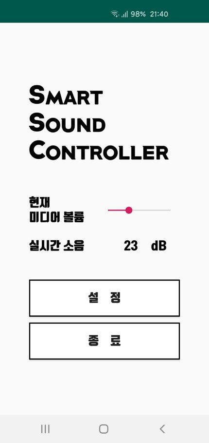

# SmartSoundController

주변 소음을 측정하여 자동으로 미디어 볼륨을 조절해주는 어플리케이션

   

## 😎 author

[youseokhwan](https://github.com/youseokhwan)

## 💻 development environment

- MacBook Pro 2017(Mojave 10.14.5) / Android Studio 3.4
- Windows 10 Education 64bit(1809) / Arduino Sketch 1.8.9

## 🔨 hardware requirements

- Android Device
- Arduino Uno(R3), Sound Sensor(SZH-EK033), Bluetooth HC-06 Module(SZH-EK010)

## 📚 usage

- Android Device에 apk 파일을 [다운로드](https://github.com/youseokhwan/SmartSoundController/blob/master/app-debug.apk?raw=true) 및 설치
- 아두이노 보드의 블루투스 모듈(HC-06)과 Android Device를 페어링
- 앱 실행 후 자신에 맞는 볼륨 값, dB 등 설정

## 😥 issues

- 블루투스 페어링 화면 scan 버튼 미구현(미리 페어링 후 앱 실행해야 함)
- 센서의 상태에 따라 측정값이 부정확할 수 있고, 정확한 dB값이 아닌 전압 값만을 이용해 계산한 임시적인 값
- 백그라운드 동작 미구현

## 📋 notes

- 2019년 3-1학기 모바일프로그래밍 강의의 기말 프로젝트로 제출
- 추후 아두이노없이 내장 마이크 센서로 구현할 계획
- Galaxy S10e(SM-G970N)에서만 테스트하였습니다.
